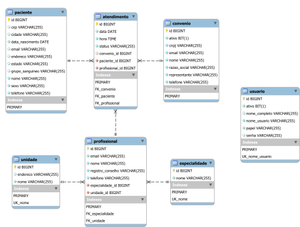

# frameworks-back-end
Repositório da disciplina Frameworks Back-end

# Atualizando seu repositório local

O código produzido em sala de aula, e compartilhado neste repositório, pode ser atualizado em seu repositório local com o comando:

```console
git pull
```

No entando, se você fez alterações no seu repositório local, o comando acima pode gerar conflitos. Para evitar lidar com isso, você pode forçar uma atualização com o repositório remoto por meio dos comandos:

```console
git fetch origin
git reset --hard origin/main
```

O primeiro comando recebe as atualizações mais recentes do repositório remoto, e o segundo descarta todas as alterações locais e atualiza com o histórico mais recente do repositório remoto (branch main).

# Sites de referência

- Spring Boot Reference Documentation: <https://docs.spring.io/spring-boot/docs/current/reference/html/index.html>
- Spring Getting Started Guides: <https://spring.io/guides#getting-started-guides>
- Spring Boot in Visual Studio Code: <https://code.visualstudio.com/docs/java/java-spring-boot>
- Uma visão geral do HTTP: <https://developer.mozilla.org/en-US/docs/Web/HTTP/Overview>
- Apostila Java e Orientação a Objetos (Caelum/Alura): <https://www.alura.com.br/apostila-java-orientacao-objetos>
- Baeldung: <https://www.baeldung.com/>

# Ferramentas

- __Visual Studio Code__
  - <https://code.visualstudio.com/Download>
- __Extension Pack for Java (Extensão do VS Code)__
  - <https://marketplace.visualstudio.com/items?itemName=vscjava.vscode-java-pack>
- __Spring Boot Extension Pack (Extensão do VS Code)__
  - <https://marketplace.visualstudio.com/items?itemName=pivotal.vscode-boot-dev-pack>
- __Thunder Client (Extensão do VS Code)__
  - <https://marketplace.visualstudio.com/items?itemName=rangav.vscode-thunder-client>
- __XML (Extensão do VS Code)__
  - <https://marketplace.visualstudio.com/items?itemName=redhat.vscode-xml>
- __Git__
  - <https://git-scm.com/downloads>
- __JDK 17__
  - Para verificar se o JDK está corretamente instalado e configurado, digite no prompt de comandos:
    - ```javac -version```
  - Se necessário, realizar a instalação e configuração:
    - Link para download: <https://download.oracle.com/java/17/archive/jdk-17.0.6_windows-x64_bin.msi>
    - Criar a variável de ambiente JAVA_HOME configurada para o diretório de instalação do JDK. Exemplo: “C:\Program Files\Java\jdk-17”.
    - Adicionar “%JAVA_HOME% bin” na variável de ambiente PATH.
    - Tutorial de configuração: <https://mkyong.com/java/how-to-set-java_home-on-windows-10/>
- __Maven__
  - Para verificar se o Maven está corretamente instalado e configurado, digite no prompt de comandos:
    - ```mvn -version```
  - Se necessário, realizar a instalação e configuração:
    - Link para download: <https://dlcdn.apache.org/maven/maven-3/3.8.8/binaries/apache-maven-3.8.8-bin.zip>
    - Adicionar o diretório de instalação do Maven na variável de ambiente PATH. Exemplo: “C:\apache-maven\bin”.
    - Tutorial de instalação: <https://mkyong.com/maven/how-to-install-maven-in-windows/>
- __MySQL__
  - Verificar se o MySQL está funcionando:
    - Para tentar conectar no MySQL, no prompt de comandos digite:
      - ```mysql -u root -p```
    - Tentar acessar com senha em branco ou senha igual ao nome de usuário (root).
    - Tutorial para resetar a senha de root, caso necessário: <https://dev.mysql.com/doc/mysql-windows-excerpt/8.0/en/resetting-permissions-windows.html>
  - Remova o banco de dados ```sgcm```, se existir:
    - No prompt de comandos digite:
      - ```mysql -u root -p```
    - Ao conectar no MySQL, execute a seguinte instrução SQL:
      - ```DROP DATABASE sgcm;```
  - Se necessário, realizar a instalação:
    - Link para download: <https://dev.mysql.com/downloads/file/?id=512698>
    - [Tutorial de instalação](https://github.com/webacademyufac/tutoriais/blob/main/mysql/mysql.md)

# SGCM - Diagrama de Classes


# SGCM - Diagrama Entidade Relacionamento


