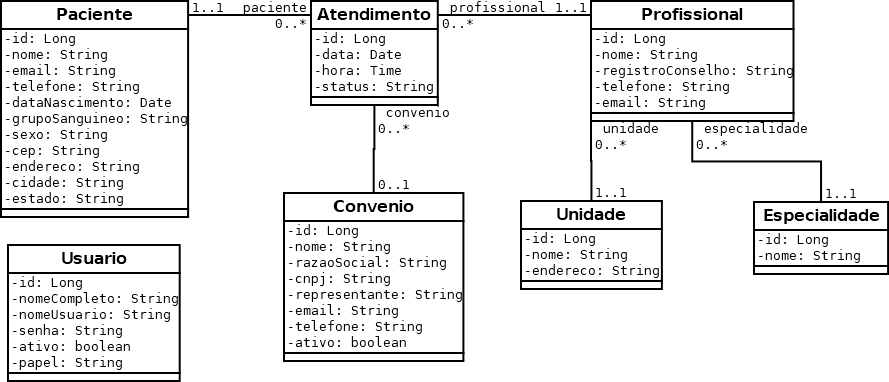

# frameworks-front-end
Repositório da disciplina Frameworks Front-end

# Atualizando seu repositório local

O código produzido em sala de aula, e compartilhado neste repositório, pode ser atualizado em seu repositório local com o comando:

```console
git pull
```

No entando, se você fez alterações no seu repositório local, o comando acima pode gerar conflitos. Para evitar lidar com isso, você pode forçar uma atualização com o repositório remoto por meio dos comandos:

```console
git fetch origin
git reset --hard origin/main
```

O primeiro comando recebe as atualizações mais recentes do repositório remoto, e o segundo descarta todas as alterações locais e atualiza com o histórico mais recente do repositório remoto (branch main).

# Dependências do projeto

As dependências do projeto não são compartilhadas no repositório. Para instalar as dependências, a partir da raiz do projeto, no prompt de comandos, digite: ```npm install```.

# Sites de referência

- Angular Docs: <https://angular.io/docs>
- TypeScript Documentation: <https://www.typescriptlang.org/docs/>
- MDN Web Docs - Aprendendo desenvolvimento web: <https://developer.mozilla.org/pt-BR/docs/Learn>
- Using Angular in Visual Studio Code: <https://code.visualstudio.com/docs/nodejs/angular-tutorial>

# Ferramentas

- __Visual Studio Cod__
  - <https://code.visualstudio.com/Download>
- __Angular Language Service (Extensão do VS Code)__
  - <https://marketplace.visualstudio.com/items?itemName=Angular.ng-template>
- __Git__
  - <https://git-scm.com/downloads>
- __Node.js (e npm)__
  - Versão 18 (LTS).
  - Para verificar a versão do Node.js, no prompt de comandos digite:
    - ```node --version```
  - Link para download: <https://nodejs.org/en/download/>
- __Angular CLI__
  - Versão 15.
  - Para verificar a versão do Angular CLI, no prompt de comandos digite:
    - ```ng version```
  - Tutorial de instalação: <https://angular.io/guide/setup-local>
  - Para instalar o Angular CLI, no prompt de comandos digite:
    - ```npm i -g @angular/cli@15```

# SGCM - Diagrama de Classes



# SGCM - Diagrama Entidade Relacionamento


